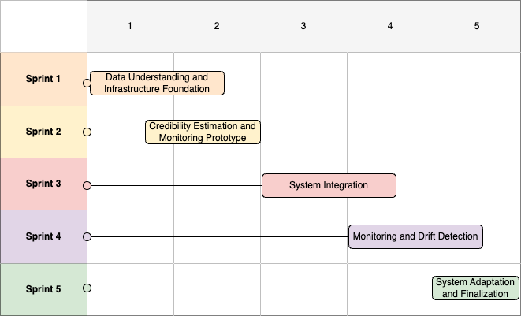

# Project Proposal & Development Plan

**Project Title:** News Credibility Estimation  
**Version:** 1.1

**Team:**
- **Sofia Bragagnolo** – Project Manager  
- **Ester De Giosa** – Data Scientist  
- **Alina Fogar** – MLOps Engineer  
- **Riccardo Samaritan** – Software Developer  

---
## TABLE OF CONTENTS
- [Project Proposal \& Development Plan](#project-proposal--development-plan)
  - [TABLE OF CONTENTS](#table-of-contents)
  - [PROJECT SUMMARY](#project-summary)
    - [Scope](#scope)
    - [Objectives](#objectives)
    - [Relevance](#relevance)
  - [DELIVERABLES](#deliverables)
    - [Data Pipeline](#data-pipeline)
    - [ML Kernel](#ml-kernel)
    - [CI/CD Pipeline](#cicd-pipeline)
    - [Monitoring and Drift Detection](#monitoring-and-drift-detection)
  - [MILESTONES](#milestones)
  - [WORK BREAKDOWN STRUCTURE (WBS)](#work-breakdown-structure-wbs)
    - [1. Project Management and Infrastructure](#1-project-management-and-infrastructure)
    - [2. Data Management and Preparation](#2-data-management-and-preparation)
    - [3. Credibility Estimation Model and Mock Monitoring](#3-credibility-estimation-model-and-mock-monitoring)
    - [4. API, Deployment and System Integration](#4-api-deployment-and-system-integration)
    - [5. Monitoring and Drift Observation](#5-monitoring-and-drift-observation)
    - [6. System Adaptation and Finalization](#6-system-adaptation-and-finalization)
  - [GANTT-STYLE SCHEDULE](#gantt-style-schedule)
    - [**Sprint 1 – Data Understanding and Infrastructure Foundation**](#sprint-1--data-understanding-and-infrastructure-foundation)
    - [**Sprint 2 – Credibility Estimation and Monitoring Prototype**](#sprint-2--credibility-estimation-and-monitoring-prototype)
    - [**Sprint 3 – System Integration**](#sprint-3--system-integration)
    - [**Sprint 4 – Monitoring and Drift Detection**](#sprint-4--monitoring-and-drift-detection)
    - [**Sprint 5 – System Adaptation and Finalization**](#sprint-5--system-adaptation-and-finalization)
  - [DEFINITION OF DONE (DoD)](#definition-of-done-dod)
  - [DEFINITION OF READY (DoR)](#definition-of-ready-dor)
  - [RESOURCES \& INFRASTRUCTURE](#resources--infrastructure)

## PROJECT SUMMARY

### Scope
The goal of this project is the design and implementation of a **complete end-to-end MLOps system** for estimating the credibility of news articles based on textual content.  
Rather than focusing exclusively on model accuracy, the project emphasizes the entire machine learning lifecycle, including data ingestion, preprocessing, model training, evaluation, deployment, monitoring, and maintenance.

Real-world information is messy and constantly changing. 
Our system treats credibility as a scale rather than a simple "true or false" classification. The system outputs a **continuous credibility score**, representing the degree of reliability of a news article based on its textual characteristics.  

An important aspect of the project is the management of **changes over time**, addressing data drift and model performance degradation caused by the evolution of language, different topics, and writing styles in news content.

We are not handling real-world moderation actions (e.g., content removal) or direct integration with external social media platforms. The project remains a demonstrative but production-inspired MLOps implementation.

---

### Objectives

The primary objective is to develop a **reproducible and automated ML pipeline** capable of estimating news credibility from text, covering data preparation, training, evaluation, and deployment.

Specific objectives include:

- Designing a robust data pipeline that supports dataset versioning and repeatable experiments
- Training and evaluating multiple models and selecting suitable trade-offs between performance and operational complexity.
- Implementing model monitoring mechanisms to observe model outputs and system behaviour
- Detecting data drift and concept drift
- Defining clear strategies for model retraining and system adaptation, when monitored metrics indicate degradation

---

### Relevance
The project addresses the challenge of misinformation and unreliable news, highlighting how machine learning systems can assist users in evaluating the reliability of online content. From an academic perspective, the project showcases the application of modern MLOps principles (automation, monitoring, versioning, and lifecycle management) in a realistic NLP use case.

---

## DELIVERABLES

Each deliverable is designed to be independently testable, versioned and integrable into an end-to-end workflow. 

### Data Pipeline
The Data Pipeline deliverable provides a robust and reproducible workflow for validating, and preparing textual data for downstream machine learning tasks. It is implemented as a modular Python pipeline with explicit error handling, logging, and metadata generation.
It includes the following components:
- Dataset loading and validation: Safe loading of CSV datasets with file existence checks, format validation, schema verification, and informative error messages to prevent silent data corruption.
- Data cleaning and normalization: Standardization of textual inputs through lowercasing, whitespace normalization, and regex-based cleanup to reduce noise and variability.
- Dataset preparation logic: Selection of relevant attributes (title, text, label), removal of missing values and duplicates, and construction of a unified textual field combining title and article body.
- Metadata extraction: Automatic computation of dataset-level statistics such as row counts, class distribution, class balance, and missing-value summaries, enabling transparency and auditability of data changes.
- Reusable preprocessing pipeline: A single callable preprocessing function that transforms raw inputs into a clean, model-ready dataset while producing structured metadata artifacts.
  
This deliverable ensures that all data-related steps are deterministic and easily reproducible across experiments and environments.

### ML Kernel
The ML Kernel encapsulates the core feature extraction, training, evaluation, and prediction logic used to estimate news credibility.
It includes the following components:
- Text vectorization module: A lightweight, MLOps-oriented TF-IDF wrapper that couples vectorizer configuration with its fitted state, enabling consistent reuse during both training and inference.
- Configurable feature extraction: Support for tunable parameters such as vocabulary size, n-gram ranges, stopword handling, and frequency thresholds, enabling controlled experimentation.
- Model training framework: Implementation of multiple supervised learning models (Logistic Regression, Support Vector Machines, Random Forest) to establish transparent and computationally efficient baselines.
  
  * Baselines: Logistic Regression, Support Vector Machines (SVM), and Random Forest.
  * Ensemble Methods: VotingClassifier to combine multiple model predictions.
  * Advanced Model: BERT, transformer-based model(BertForSequenceClassification) for deep linguistic understanding. BERT is included as an optional advanced baseline for comparison, but is not strictly required for deployment (due to its higher computational and operational complexity).

- Probability calibration module: Post-training calibration of classifier outputs (e.g., Platt scaling or isotonic regression) to ensure that predicted probabilities are well-aligned with empirical frequencies
- Credibility score computation: Transformation of calibrated probabilities into a continuous credibility score (e.g., scaled to a [0,100] range), enabling nuanced interpretation beyond binary classification. The system uses precision_recall_fscore_support and roc_curve to analyze the binary classification outputs before converting them into a continuous credibility score.
- Evaluation utilities: Computation of both classification metrics (accuracy, precision, recall, F1-score) and probability-quality metrics (ROC-AUC, Brier score, log loss, calibration error).
- Model and artifact persistence: Serialization and versioning of trained models and vectorizers to guarantee reproducibility and compatibility between offline training and online inference.

Credibility estimation is modeled as a binary supervised classification problem, where calibrated posterior probabilities are subsequently transformed into a continuous credibility score for interpretability. The resulting credibility score should therefore be interpreted as a model-based confidence measure, rather than an absolute or objective ground truth.

The ML Kernel is intentionally model-agnostic, allowing future extensions to ensemble methods or transformer-based architectures without requiring changes to the surrounding pipeline.

### CI/CD Pipeline
The CI/CD deliverable introduces the automation and governance mechanisms across the machine learning lifecycle, bridging development and deployment. The CI/CD pipeline is triggered on code commits and pull requests. It executes automated tests for data preprocessing and model training reproducibility.
The pipeline also ensures versioning and traceability of datasets, preprocessing configurations, trained models, and evaluation artifacts.

Although simplified for an academic context, this pipeline reflects real-world CI/CD principles as applied to machine learning systems.

### Monitoring and Drift Detection
The Monitoring and Drift Detection deliverable provides continuous observability over the deployed credibility estimation system, ensuring that both system behavior and model outputs remain reliable over time.
Monitoring focuses on three levels:
1) System-level metrics: 
   - API request latency and throughput
   - Error rates and failed inference requests

    These metrics are collected using Prometheus and visualized in Grafana dashboards, enabling early detection of degradation or anomalous runtime behavior.

2) Input data characteristics: To detect changes in the nature of incoming news articles, the system monitors statistical properties of the input text. Significant deviations may indicate data drift, caused by changes in topics, writing style, or language usage over time.

3) Model outputs: The system continuously monitors model predictions (e.g., distribution of credibility scores) to observe changes in behavior that may not be immediately visible from input data alone. Shifts in these metrics can indicate concept drift.

Drift detection is implemented using statistical comparison between reference data (training or validation sets) and incoming or simulated time-based data. Because the dataset is static, drift is simulated using time-based or stratified splits that emulate temporal evolution in news content. 

When drift is detected, the system does not automatically retrain the model. Instead, detected drift events trigger alerts and inform retraining decisions.

Based on predefined criteria, the team may retrain the model using updated data or adjust preprocessing/feature extraction parameters.

---

## MILESTONES

| Milestone                                                         | Description                                                                                                                                                   | Outcome                                                                                  |
|-------------------------------------------------------------------|---------------------------------------------------------------------------------------------------------------------------------------------------------------|------------------------------------------------------------------------------------------|
| 1. Data Exploration, Preprocessing, and Infrastructure Foundation | Initial phase focused on understanding data sources, cleaning and transforming data, setting up the technical infrastructure required for subsequent development. | Established data pipelines, validated datasets, and a stable infrastructure environment. |
| 2. Baseline Credibility Model and Monitoring Prototype            | Development of an initial model to assess credibility, along with a prototype for monitoring system performance and data quality.                             | Functional baseline model and preliminary monitoring dashboard.                          |
| 3. Fully Automated Pipeline and System Integration                | Automation of data ingestion, model training, and deployment processes, ensuring seamless integration with existing systems.                                  | End-to-end automated workflow and integrated system components.                          |
| 4. Monitoring and Drift Detection                        | Implementation of monitoring tools to detect data or model drift, ensuring long-term reliability and performance.                                    | Comprehensive monitoring framework with drift detection capabilities.                    |
| 5. System Adaptation, Validation, and Final Delivery              | Final refinement of the system, including validation, performance tuning, and preparation for production deployment.                                          | Validated, production-ready system delivered with documentation and performance reports. |

---

## WORK BREAKDOWN STRUCTURE (WBS)
The work breakdown structure is a hierarchical breakdown of the project's scope, it decomposes the project into smaller and smaller pieces until they’re manageable.

### 1. Project Management and Infrastructure 
- Team communication and Agile coordination (Slack)
- Requirements definition
- Project scope and objectives specification
- Sprint plan and coordination artifacts
- Project repository and documentation structure (GitHub)
- Infrastructure setup (Docker environment configuration)

### 2. Data Management and Preparation
- Dataset acquisition (WELFake)
- Data understanding, exploration and statistical analysis
- Data quality assessment (missing values, duplicates, noise)
- Text preprocessing pipeline (cleaning, normalization)
- Feature engineering
- Data splitting and versioning

### 3. Credibility Estimation Model and Mock Monitoring
- Baseline model selection and implementation
- Model training and hyperparameter tuning
- Model evaluation and metric selection
- Credibility score definition and calibration
- Model performance evaluation

### 4. API, Deployment and System Integration
- Mock API development (Flask) 
- Integration of trained model into API (Swapping Mock with Real Model)
- Input/output interface specification (API + UI)
- Pipeline automation (training and inference)
- End-to-end system testing

### 5. Monitoring and Drift Observation
- Monitoring requirements specification
- Initial Monitoring Stack setup (Prometheus & Grafana) connected to Mock API
- Input data monitoring
- Prediction and performance monitoring
- Drift detection method implementation
- Drift simulation (using time-based data splits) and validation

### 6. System Adaptation and Finalization
- Retraining and model update strategy specification
- Post-adaptation model evaluation
- Final system validation
- Performance comparison before and after drift
- Final documentation and reporting

---

## GANTT-STYLE SCHEDULE
Sprint Plan.

### **Sprint 1 – Data Understanding and Infrastructure Foundation**
Collaboration, version control, and experiment tracking tools were initialized during Sprint 1 and used continuously across all subsequent sprints to support Agile development and MLOps best practices.

* Setup of version control and collaboration workflows (GitHub)
* Setup of experiment tracking (Weights & Biases)
* Setup of team communication and sprint coordination channels (Slack)
* Exploratory analysis of the WELFake dataset
* Data quality assessment and text preprocessing
* Feature engineering and dataset versioning
* Definition of the data processing pipeline
* Setup of project structure and documentation
* Setup of Docker environment and basic infrastructure

**Deliverables:**
* Configured GitHub repository
* Initialized Weights & Biases project for experiment tracking
* Operational team communication channels
* Cleaned and preprocessed dataset
* Documented data pipeline
* Initial project documentation
* Docker Compose configuration for the project

---

### **Sprint 2 – Credibility Estimation and Monitoring Prototype**

* Selection and implementation of a baseline machine learning model
* Model training and hyperparameter tuning
* Definition of evaluation metrics
* Credibility score definition and calibration
* Implementation of Mock API
* Implementation of initial/prototype Grafana dashboards

**Deliverables:**
* Trained baseline credibility model
* Defined credibility scoring approach
* Evaluation results and metric analysis
* Mock API with initial monitoring stack
  
---

### **Sprint 3 – System Integration**

* Integration of the trained ML model into the Flask API (replacing Mock)
* Definition and implementation of input/output interfaces
* Model deployment setup
* Automation of the training and inference pipeline
* End-to-end system testing
  
**Deliverables:**
* End-to-end executable system
* Automated ML pipeline
* Deployed model with API access
* Fully integrated User Dashboard

---

### **Sprint 4 – Monitoring and Drift Detection**
* Definition of monitoring metrics for inputs and predictions
* Implementation of drift detection algorithms
* Simulation of data drift using time-based splits
* Monitoring of system behavior over simulated time
* Validation and interpretation of drift detection results

**Deliverables:**
* Monitoring and logging components
* Drift detection mechanism
* Drift analysis and validation results
---

### **Sprint 5 – System Adaptation and Finalization**

* Definition and execution of model retraining or update strategy
* Model adaptation based on detected drift
* Final system validation and performance assessment
* Performance comparison before and after adaptation
* Final system validation and documentation

**Deliverables:**
* Updated or retrained model
* Performance comparison report
* Final validated system
* Complete project documentation

---

## DEFINITION OF DONE (DoD)

## DEFINITION OF READY (DoR)

---

## RESOURCES & INFRASTRUCTURE

- **Dataset:** **WELFake**
  
  The **WELFake** dataset provides binary labels indicating whether an article is real or fake. These labels are treated as a proxy for credibility. This assumption introduces limitations related to labeling noise, source bias, and temporal validity, which are explicitly acknowledged in the system evaluation.

- **Programming Language:** Python 3.12
- **ML & Data Libraries:** 
  - **Data Handling**: pandas, numpy, datasets (Hugging Face)
  - **Visualization**: matplotlib, seaborn, wordcloud
  - **Preprocessing**: re (Regular Expressions), TfidfVectorizer
  - **Classical ML (Scikit-learn):** LogisticRegression, SVC, LinearSVC, RandomForestClassifier, MLPClassifier, KMeans, VotingClassifier
  - **Deep Learning & NLP:** torch (PyTorch), transformers (BERT Tokenizer and Sequence Classification)
- **MLOps Tools:** Git, CI/CD pipelines, monitoring frameworks 
- **Resources:** 
- **Infrastructure & Monitoring:** 
- - **Docker & Docker Compose** (Containerization)
  - **Prometheus** (Metrics Collection)
  - **Grafana** (Visualization & Alerting)
  - **Flask** (Inference API)
  - **Streamlit** (User Interface)