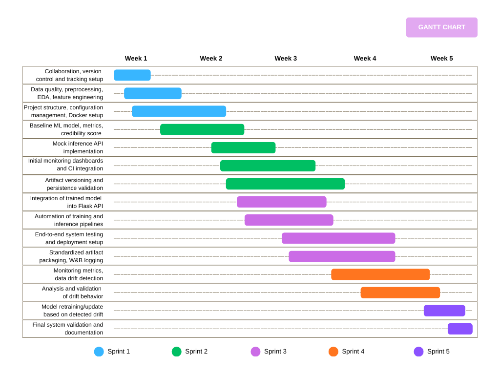

# Project Proposal & Development Plan

**Project Title:** News Credibility Estimation  
**Version:** 2.0

**Team:**
- **Sofia Bragagnolo** – Project Manager  
- **Ester De Giosa** – Data Scientist  
- **Alina Fogar** – MLOps Engineer  
- **Riccardo Samaritan** – Software Developer  

---

## TABLE OF CONTENTS
- [Project Proposal \& Development Plan](#project-proposal--development-plan)
  - [TABLE OF CONTENTS](#table-of-contents)
  - [PROJECT SUMMARY](#project-summary)
    - [Scope](#scope)
    - [Objectives](#objectives)
    - [Relevance](#relevance)
  - [DELIVERABLES](#deliverables)
    - [Data Pipeline](#data-pipeline)
    - [ML Kernel](#ml-kernel)
    - [CI/CD Pipeline](#cicd-pipeline)
    - [Monitoring and Drift Detection](#monitoring-and-drift-detection)
  - [MILESTONES](#milestones)
  - [WORK BREAKDOWN STRUCTURE (WBS)](#work-breakdown-structure-wbs)
    - [1. Project Management and Infrastructure](#1-project-management-and-infrastructure)
    - [2. Data Management and Preparation](#2-data-management-and-preparation)
    - [3. Credibility Estimation Model and Mock Monitoring](#3-credibility-estimation-model-and-mock-monitoring)
    - [4. API, Deployment and System Integration](#4-api-deployment-and-system-integration)
    - [5. Monitoring and Drift Observation](#5-monitoring-and-drift-observation)
    - [6. System Adaptation and Finalization](#6-system-adaptation-and-finalization)
  - [GANTT-STYLE SCHEDULE](#gantt-style-schedule)
    - [**Sprint 1 – Data Understanding and Infrastructure Foundation**](#sprint-1--data-understanding-and-infrastructure-foundation)
    - [**Sprint 2 – Credibility Estimation and Monitoring Prototype**](#sprint-2--credibility-estimation-and-monitoring-prototype)
    - [**Sprint 3 – System Integration**](#sprint-3--system-integration)
    - [**Sprint 4 – Monitoring and Drift Detection**](#sprint-4--monitoring-and-drift-detection)
    - [**Sprint 5 – System Adaptation and Finalization**](#sprint-5--system-adaptation-and-finalization)
  - [DEFINITION OF READY (DoR)](#definition-of-ready-dor)
    - [Sprint 1](#sprint-1)
    - [Sprint 2](#sprint-2)
    - [Sprint 3](#sprint-3)
    - [Sprint 4](#sprint-4)
    - [Sprint 5](#sprint-5)
  - [DEFINITION OF DONE (DoD)](#definition-of-done-dod)
    - [Sprint 1](#sprint-1-1)
    - [Sprint 2](#sprint-2-1)
    - [Sprint 3](#sprint-3-1)
    - [Sprint 4](#sprint-4-1)
    - [Sprint 5](#sprint-5-1)
  - [RESOURCES \& INFRASTRUCTURE](#resources--infrastructure)
    - [Dataset](#dataset)
    - [Coordination](#coordination)
    - [Development](#development)
    - [Deployment \& Infrastructure](#deployment--infrastructure)

## PROJECT SUMMARY

### Scope
The goal of this project is the design and implementation of a **complete end-to-end MLOps system** for estimating the credibility of news articles based on textual content.  
Rather than focusing exclusively on model accuracy, the project emphasizes the entire machine learning lifecycle, including data ingestion, preprocessing, model training, evaluation, deployment, monitoring, and maintenance.

Our system treats credibility as a **continuous scale** rather than a simple "true or false" classification. The system outputs a **credibility score**, representing the degree of reliability of a news article based on its textual characteristics.

An important aspect is the management of **changes over time**, addressing data drift and model performance degradation caused by the evolution of language, different topics, and writing styles in news content.

We do not handle real-world moderation actions (e.g., content removal) or direct integration with external social media platforms. The project remains a demonstrative but **production-inspired MLOps implementation**, showcasing reproducible pipelines, automated workflows and monitoring best practices.

---

### Objectives

The primary objective is to develop a **reproducible and automated ML pipeline** for estimating the credibility of news articles from text, covering data preparation, model training, evaluation, deployment, and monitoring.

Specific objectives include:

- Designing a **robust data pipeline** that supports dataset versioning, reproducible preprocessing, and consistent feature extraction.
- Training and evaluating multiple models, and selecting suitable trade-offs between predictive performance and operational complexity.
- Implementing **monitoring mechanisms** to observe model outputs and system behaviour over time.
- Detecting **data drift and concept drift**, ensuring that shifts in input distributions or model performance are captured early.
- Defining clear **strategies for model retraining and system adaptation**, triggered by observed degradation in monitored metrics.

---

### Relevance
The project tackles the problem of misinformation and unreliable news, demonstrating how machine learning systems can support users in assessing the credibility of online content. From an academic perspective, it highlights the practical application of modern MLOps principles including automation, monitoring, versioning, and lifecycle management.x

By treating credibility as a **continuous score** rather than a binary label, the system provides insights into content reliability, while offering a structured framework for reproducible, production-inspired ML pipelines.

---

## DELIVERABLES

Each deliverable is designed to be independently testable, versioned and integrable into an end-to-end workflow. 

### Data Pipeline
The Data Pipeline deliverable provides a **robust and reproducible workflow** for validating and preparing textual data for downstream machine learning tasks. It is implemented as a **modular Python pipeline** with explicit error handling, logging, and metadata generation.

Key components include:

- **Dataset loading and validation**: Safe loading of CSV datasets, including file existence checks, format validation, schema verification, and informative error messages to prevent silent data corruption.
- **Data cleaning and normalization**: Standardization of textual inputs through lowercasing, whitespace normalization, and regex-based cleaning to reduce noise and variability.
- **Dataset preparation**: Selection of relevant fields (title, text, label), removal of missing values and duplicates, and creation of a unified textual field combining title and article body.
- **Metadata extraction**: Automatic computation of dataset-level statistics, including row counts, class distribution, class balance, and missing-value summaries.
- **Reusable preprocessing pipeline**: A single callable function that transforms raw inputs into a clean, model-ready dataset while producing structured metadata artifacts.
  
This deliverable ensures that **all data-related steps are deterministic and reproducible** across experiments and environments.

### ML Kernel
The ML Kernel encapsulates the core feature extraction, training, evaluation, and prediction logic used to estimate news credibility.

It includes the following components:
- **Text vectorization module**: A lightweight, MLOps-oriented TF-IDF wrapper that couples vectorizer configuration with its fitted state, enabling consistent reuse during both training and inference.
- **Configurable feature extraction**: Support for tunable parameters such as vocabulary size, n-gram ranges, stopword handling, and frequency thresholds, enabling controlled experimentation.
- **Model training framework**: Implementation of multiple supervised learning models, including Logistic Regression, Random Forest, and Support Vector Machines (SVM).
  
  * Baselines implemented in the codebase: Logistic Regression, Random Forest and SVM.
  * The codebase is intentionally extensible: ensemble methods or transformer-based models can be added later without changing the surrounding pipeline interfaces.

- **Probability calibration module**: Post-training calibration of classifier outputs (e.g., Platt scaling or isotonic regression) to ensure that predicted probabilities are well-aligned with empirical frequencies
- **Credibility score computation**: Transformation of calibrated probabilities into a credibility score, enabling interpretation beyond binary classification. The credibility score is scaled to a [0,100] range.
- **Evaluation utilities**: Computation of both classification metrics (accuracy, precision, recall, F1-score) and probability-quality metrics (ROC-AUC, Brier score, log loss, calibration error).
- **Model and artifact persistence**: Serialization and versioning of trained models and vectorizers to guarantee reproducibility and compatibility between offline training and online inference.

Credibility estimation is modeled as a binary supervised classification problem, where **calibrated posterior probabilities** for the *Real News Class* are subsequently transformed into a continuous credibility score for interpretability. The resulting score should therefore be interpreted as a **model-based confidence measure**, rather than an absolute or objective ground truth.

The ML Kernel is intentionally model-agnostic, allowing future extensions to ensemble methods or transformer-based architectures without requiring changes to the surrounding pipeline.

### CI/CD Pipeline
The CI/CD deliverable introduces the automation and governance mechanisms across the machine learning lifecycle, bridging development and deployment. The CI/CD pipeline is triggered on code commits and pull requests. It executes automated tests for data preprocessing and model training reproducibility.
The pipeline also ensures versioning and traceability of datasets, preprocessing configurations, trained models, and evaluation artifacts.

Although simplified for an academic context, this pipeline reflects real-world CI/CD principles as applied to machine learning systems.

### Monitoring and Drift Detection
The Monitoring and Drift Detection deliverable provides continuous observability over the deployed credibility estimation system, ensuring that both system behaviour and model outputs remain reliable over time.
Monitoring focuses on three levels:
1) System-level metrics: 
   - API request latency and throughput
   - Error rates and failed inference requests

    These metrics are collected using Prometheus and visualized in Grafana dashboards, enabling early detection of degradation or anomalous runtime behaviour.

2) Input data characteristics: To detect changes in the nature of incoming news articles, the system monitors statistical properties of the input text. Significant deviations may indicate data drift, caused by changes in topics, writing style, or language usage over time.

3) Model outputs: The system continuously monitors model predictions to observe changes in behaviour that may not be immediately visible from input data alone. Shifts in these metrics can indicate concept drift.

Drift detection is implemented using statistical comparison between reference data and incoming (or simulated) batches. Because the dataset is static, drift is simulated via reference/tail splits and/or curated incoming batches that emulate distributional shifts. 

When drift is detected, the system does not automatically retrain the model. Instead, detected drift events trigger alerts and inform retraining decisions.
The team may decide to retrain the model using updated data or adjust preprocessing/feature extraction parameters.

---

## MILESTONES

| Milestone                                                         | Description                                                                                                                                                   | Outcome                                                                                  |
|-------------------------------------------------------------------|---------------------------------------------------------------------------------------------------------------------------------------------------------------|------------------------------------------------------------------------------------------|
| Data Exploration, Preprocessing, and Infrastructure Foundation | Initial phase focused on understanding data sources, cleaning and transforming data, and setting up the technical infrastructure required for subsequent development. | Established data pipelines, validated datasets, and a stable infrastructure environment. |
| Baseline Credibility Model and Monitoring Prototype            | Development of an initial model to assess credibility, along with a prototype for monitoring system performance and data quality.                             | Functional baseline model and preliminary monitoring dashboard.                          |
| Fully Automated Pipeline and System Integration                | Automation of data ingestion, model training, and deployment processes, ensuring seamless integration with existing systems.                                  | End-to-end automated workflow and integrated system components.                          |
| Monitoring and Drift Detection                        | Implementation of monitoring tools to detect data or model drift, ensuring long-term reliability and performance.                                    | Comprehensive monitoring framework with drift detection capabilities.                    |
| System Adaptation, Validation, and Final Delivery              | Final refinement of the system, including validation, performance tuning, and preparation for production deployment.                                          | Validated, production-ready system delivered with documentation and performance reports. |

---

## WORK BREAKDOWN STRUCTURE (WBS)
The Work Breakdown Structure decomposes the project scope into manageable components, organizing tasks hierarchically from high-level objectives to actionable items.

### 1. Project Management and Infrastructure 
- Team communication and Agile coordination via Slack
- Definition of requirements and project scope
- Specification of objectives and success criteria
- Sprint planning and management artifacts
- Project repository setup and documentation structure on GitHub
- Infrastructure setup including Docker environment configuration

### 2. Data Management and Preparation
- Acquisition of WELFake dataset
- Data understanding, exploration analysis, and statistical profiling
- Assessment of data quality (missing values, duplicates, noise)
- Development of text preprocessing pipeline (cleaning, normalization)
- Feature engineering
- Dataset splitting (train/validation/test) and versioning

### 3. Credibility Estimation Model and Mock Monitoring
- Selection and implementation of baseline models (Logistic Regression, SVM, Random Forest)
- Model training and hyperparameter tuning
- Evaluation and selection of performance metrics
- Credibility score definition and probability calibration (Platt scaling/isotonic)
- Performance assessment on validation data

### 4. API, Deployment and System Integration
- Development of a mock API (Flask) 
- Integration of trained ML model into API (replace mock with real Model)
- Definition of input/output interfaces (API and UI)
- Automation of training and inference pipelines
- End-to-end system testing for correctness and reproducibility

### 5. Monitoring and Drift Observation
- Specification of monitoring metrics and thresholds
- Initial monitoring stack setup (Prometheus & Grafana) connected to mock API
- Monitoring of input data characteristics
- Monitoring of model predictions and performance metrics
- Implementation of drift detection methods
- Drift simulation using time-based data splits or curated batches
- Validation and interpretation of drift detection results

### 6. System Adaptation and Finalization
- Specification of retraining and model update strategy
- Post-adaptation evaluation of model performance
- Final system validation
- Comparison of system performance before and after adaptation
- Completion of final documentation and reporting

---

## GANTT-STYLE SCHEDULE
Sprint Plan.

### **Sprint 1 – Data Understanding and Infrastructure Foundation**
Collaboration, version control, and experiment tracking tools were initialized during Sprint 1 and used continuously throughout the project to support Agile development and MLOps best practices.

* Setup of version control and collaboration workflows (GitHub)
* Setup of experiment tracking (Weights & Biases)
* Setup of team communication and sprint coordination channels (Slack)
* Exploratory analysis of the WELFake dataset
* Data quality assessment and text preprocessing
* Feature engineering and dataset versioning
* Definition of the data processing pipeline
* Setup of project structure and documentation
* Setup of Docker environment and basic infrastructure
* Definition of a modular repository structure (`src/`, `pipelines/`, `tests/`, `configs/`, `docs/`)
* Centralized configuration management through `src/config.py` with YAML-based overrides
* Deterministic training settings with fixed seeds and controlled split parameters

**Deliverables:**
* Configured GitHub repository
* Initialized Weights & Biases project for experiment tracking
* Operational team communication channels
* Cleaned and preprocessed dataset
* Documented data pipeline
* Initial project documentation
* Docker Compose configuration for the project

---

### **Sprint 2 – Credibility Estimation and Monitoring Prototype**

* Selection and implementation of a baseline machine learning model
* Model training and hyperparameter tuning
* Definition of evaluation metrics
* Definition and calibration of the credibility score
* Implementation of a mock inference API
* Implementation of initial (prototype) Grafana dashboards
* Integration of CI quality gates with automated linting (Ruff) and test execution (ML, API, UI)
* CI smoke training run to validate automated execution of the training pipeline
* Initial artifact versioning using run-based directories (`artifacts/run_<timestamp>`)
* Validation of model, vectorizer, and metrics persistence and reloadability through automated tests

**Deliverables:**
* Trained baseline credibility model
* Defined credibility scoring approach
* Evaluation results and metric analysis
* Mock API with initial monitoring stack
  
---

### **Sprint 3 – System Integration**

* Integration of the trained machine learning model into the Flask API (replacing the mock implementation)
* Definition and implementation of input/output interfaces
* Model deployment setup
* Automation of both training and inference pipeline
* End-to-end system testing
* Standardized per-run artifact bundle generation (model, vectorizer, metrics, run configuration, preprocessing metadata)
* Optional integration with Weights & Biases for run configuration logging, metric tracking, and artifact publishing
  
**Deliverables:**
* End-to-end executable system
* Automated ML pipeline
* Deployed model accessible via API
* Fully integrated user dashboard

---

### **Sprint 4 – Monitoring and Drift Detection**
* Definition of monitoring metrics for input data and model predictions
* Implementation of data drift detection mechanisms
* Simulation of data drift using reference and tail data splits, as well as incoming data batches
* Monitoring of system behaviour over simulated time
* Validation and interpretation of drift detection results

**Deliverables:**
* Monitoring and logging components
* Drift detection mechanism
* Drift analysis and validation results
---

### **Sprint 5 – System Adaptation and Finalization**

* Definition and execution of model retraining or update strategy
* Model adaptation based on detected drift
* Final system validation and performance assessment
* Performance comparison before and after adaptation
* Final system validation and documentation

**Deliverables:**
* Updated or retrained model
* Performance comparison report
* Final validated system
* Complete project documentation

---

## DEFINITION OF READY (DoR)

A task can be defined as **Ready** if the objective and expected outcome are defined, accepted, and agreed upon by the team, and if it is assigned to one or more team members.

Acceptance criteria must be specified and aligned with the project’s Definition of Done and dependencies on previous tasks or deliverables must be identified and resolved.

Only Ready items may be pulled into an active sprint.

### Sprint 1
- Team roles and responsibilities are assigned.
- The dataset source (WELFake) is accessible and verified
- Python environment is configured with all required libraries.
- Preprocessing scripts for text cleaning and normalization are available.
- The scope of data exploration and preprocessing is defined.
- Expected outputs of the data pipeline are specified.
- Infrastructure requirements (Docker setup, repository structure) are agreed upon.

### Sprint 2 
- Cleaned and versioned datasets from Sprint 1 are available.
- Feature representation strategy (TF-IDF) is agreed upon.
- Baseline model candidates are selected
- Evaluation metrics and validation strategy are defined
- Mock inference API requirements are specified
- Monitoring goals for the prototype stage are defined

### Sprint 3
- A trained and validated model is available.
- Preprocessing pipeline is finalized, deterministic, and reproducible.
- API input/output contracts are defined.
- Monitoring metrics to be exposed by the production API are identified.
- User Interface scope and interaction flow are agreed upon.
- Deployment and execution environments are available and accessible.
- Training and inference configurations are finalized and aligned (`configs/train.yml`, `configs/test.yml`).
- Model bundle contract is defined, including serialized artifacts (`model.joblib`, `vectorizer.joblib`, run metadata).

### Sprint 4
- Monitoring infrastructure is operational.
- Logged data for inputs and model predictions is available and accessible for analysis.
- Drift definitions (criteria for detecting data or concept drift) are specified.
- Drift detection methods and thresholds are selected.
- Strategy for simulating drift scenarios (e.g., reference/tail splits, batch injections) is defined.
- CI/CD workflow on `main` branch is configured to run linting, automated tests, and ML smoke checks.
- Docker Compose validation steps and service health checks are defined in CI.
- Test suites, fixtures, and pipelines for API and UI layers are available and ready.

### Sprint 5
- Drift signals or simulated drift scenarios are available
- Retraining and model update strategies are defined and documented.
- Evaluation protocol for comparing updated models is agreed upon
- Documentation structure and final report outline are prepared and accessible.
- Final delivery requirements, acceptance criteria, and submission guidelines are clearly understood by the team.

---

## DEFINITION OF DONE (DoD)
A task or sprint is considered **Done** when all its objectives and acceptance criteria have been fulfilled, outputs are verified, and the work meets the agreed quality standards.
The Definition of Done ensures that deliverables are complete, reproducible, and ready for integration or deployment.

### Sprint 1

- The WELFake dataset is correctly loaded, cleaned, and documented.
- Relevant columns (title, text, label) are selected and merged into a unified textual representation.
- Deterministic and reproducible text preprocessing (regex-based normalization and cleaning) is implemented.
- Dataset splits (train/validation/test) are reproducible and controlled via configuration.
- Data preparation code is modular, readable, and reusable.
- Dataset assumptions, limitations, and potential biases are explicitly documented.
- A Docker-based development environment is configured and executable (`docker-compose.yml`).
- A clear and consistent project folder structure for code, data, documentation, and monitoring is established.

### Sprint 2
- A baseline credibility model is trained and evaluated.
- Multiple models are implemented and compared, with one selected as the final one.
- Hyperparameter tuning is performed for selected models.
- Model evaluation includes both classification metrics (Accuracy, Precision, Recall, F1) and probability-based analysis (ROC-AUC and calibration where applicable)
- A credibility score is defined and derived from model outputs.
- The system can ingest a news article (title and text) and return a credibility score.
- A mock inference API (Flask) is implemented to simulate production inference flow.
- A basic monitoring stack (Prometheus and Grafana) is deployed and collects metrics from the Mock API.
- The model architecture, training procedure, and key hyperparameters are documented.

### Sprint 3

- The real trained model is integrated into the Flask API (replacing the Mock).
- Vectorizer, model, and calibration artifacts are correctly loaded and used.
- User Interface (Streamlit dashboard) is implemented and connected to the API.
- The system supports batch workflow.
- The system can be run end-to-end (data → model → API → UI) following documented instructions.
- Model predictions can be logged for monitoring purposes.
- A monitoring pipeline is implemented to track input data characteristics and model outputs (credibility score distribution).
- A config-driven training pipeline persists a complete model bundle (model, vectorizer, metrics, run config, preprocessing metadata).
- A reusable inference pipeline supports batch scoring from CSV and persists predictions + summary outputs.

### Sprint 4

- Monitoring metrics for system behaviour, input data, and model outputs are defined and implemented.
- A drift detection method (statistical or simulated) is implemented and tested.
- Drift thresholds are defined and used to flag potential drift events.
- Drift behaviour is validated using simulated or time-based data splits.
- The trained model and preprocessing pipeline are versioned and deployable.
- A basic retraining or update workflow is defined and executable following drift detection.
- The system architecture and ML lifecycle workflow are documented.
- Sprint outcomes are summarized and evaluated against monitoring objectives.
- CI/CD on main automatically runs linting, unit tests, and smoke ML checks (training and drift-related checks).
- CI validates containerization by building images and running Docker Compose health checks.
- Automated test suites cover core ML pipeline smoke flow, API endpoints, and UI-triggered API interactions.

### Sprint 5

- A model adaptation strategy is defined and executed in response to detected or simulated drift.
- Model retraining or update is performed using newly available data or time-based data splits.
- The updated model: 
  * maintains or improves performance on reference data
  * continues to satisfy the functional requirements of the system
- Retraining decisions (when and why the model is updated) are justified and documented.
- The complete ML lifecycle (train → deploy → monitor → detect drift → update) is described and validated.
- The final system is evaluated against the initial project objectives.
- System limitations, assumptions, and potential future improvements are explicitly stated.
- Final documentation is completed and consistent across all deliverables.
  

## RESOURCES & INFRASTRUCTURE

The successful implementation of the proposed system relies on a combination of software tools, ML frameworks, infrastructure components, and organizational resources. Resources are organized into stacks to support development, deployment, monitoring, and reproducibility.

### Dataset 

| Component | Description |
|-----------|-------------|
| Dataset | The **WELFake** dataset provides binary labels indicating whether an article is real or fake. These labels are treated as a proxy for credibility. Limitations related to labeling noise, source bias and temporal validity are explicitly acknowledged in the system evaluation. |

### Coordination
| Tool  | Purpose |
|---------------------------|-------------|
|  Slack| Task tracking, communication, and collaborative decision making among team members|

### Development 

| Category | Tools / Libraries | Purpose |
|----------|-----------------|--------|
| Programming Language | Python 3.12 | Language for data processing, ML, and dashboards development |
| Data Handling | pandas, numpy, scipy | Efficient manipulation and computation on datasets |
| Text Preprocessing | re (Regular Expressions), TfidfVectorizer | Cleaning, normalizing, and converting text to numerical features |
| Classical ML | LogisticRegression, SVM, RandomForestClassifier, CalibratedClassifierCV | Supervised learning models for news credibility classification |
| NLP (baseline) | NLTK | Tokenization, stopword removal, and other NLP preprocessing tasks |
| Visualization | matplotlib, seaborn | Exploratory data analysis and result visualization |
| Version Control | Git | Source code management, collaboration, and reproducibility |
| Interactive Dashboards | Streamlit | User interface for inference, visualizations, and model demonstration |

### Deployment & Infrastructure 

| Task |  Services | Purpose |
|----------|-----------------|--------|
| Containerization | Docker, Docker Compose | Consistent packaging and deployment of all system components |
| Inference API | Flask | Provides RESTful endpoints for model predictions |
| Experiment Tracking | Weights & Biases (W&B) | Tracks experiments, hyperparameters, metrics, and model artifacts across training and validation |
| Metrics Collection | Prometheus | Collects system and model performance metrics |
| Monitoring & Alerting | Grafana | Visualizes metrics and triggers alerts for operational issues |
| CI/CD | GitHub Actions / CI pipelines | Automates testing, building, and deployment of the system |

